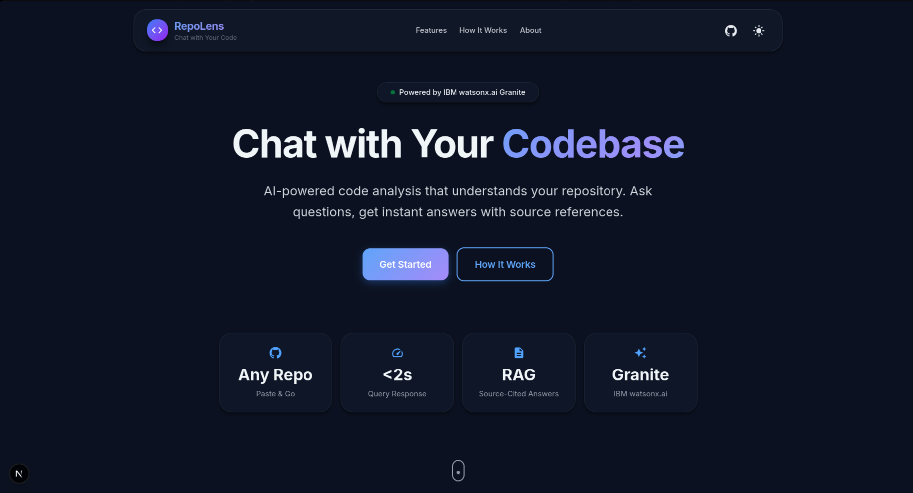
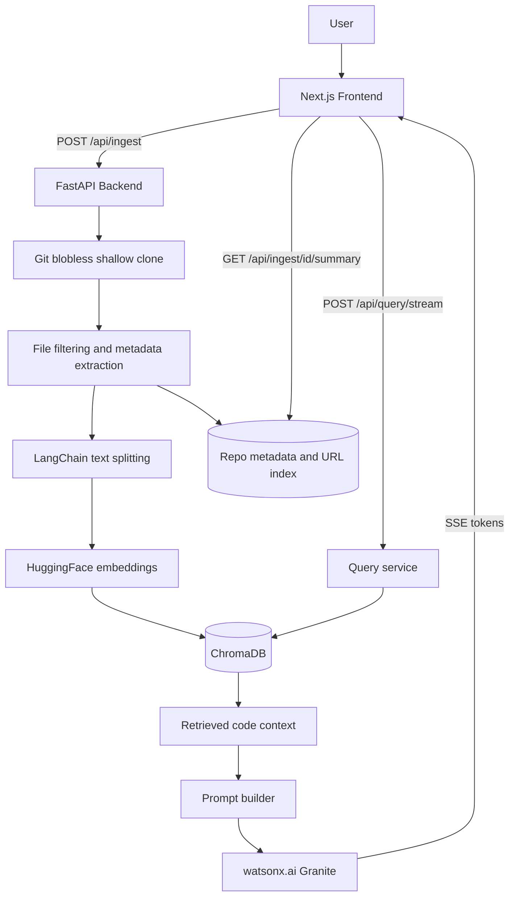

# 🔍 RepoLens

<div align="center">

[](https://www.python.org/)
[](https://fastapi.tiangolo.com/)
[](https://nextjs.org/)
[](https://www.ibm.com/watsonx)
[](LICENSE)

**Chat with any public GitHub codebase using retrieval-augmented generation, IBM watsonx.ai Granite, and source-grounded citations.**



</div>

---

## ⚡ Overview

RepoLens is a full-stack "chat with your codebase" application designed for developers. Simply paste a public GitHub repository URL, let the backend ingest and index the source files, and start asking natural-language questions about architecture, entry points, dependencies, APIs, implementation details, and debugging paths.

The system is engineered for **blazing-fast codebase onboarding**:

- 🚀 **Lightning Ingestion:** Blobless shallow Git clones with aggressive file filtering and metadata extraction.
- 🧠 **Smart Chunking:** Splits source files into semantically searchable chunks with approximate line metadata.
- 🔍 **Vector Search:** Embeddings stored in ChromaDB for high-precision semantic retrieval.
- 🤖 **Enterprise AI:** Powered by IBM watsonx.ai Granite through LangChain.
- 💬 **Real-time Streaming:** Answers streamed instantly to the UI with source snippets and line-aware citations.

---

## ✨ Key Features & Recent Upgrades

Our latest release introduces major performance overhauls and a premium **Industrial-Neon** aesthetic.

### 🎨 Frontend Innovations
- **Industrial-Neon Aesthetic:** A sleek, high-contrast UI with dark zinc tones, cyan/violet glowing text, and hardware-accelerated animations (`will-change: transform`).
- **Hardware-Accelerated Mind Map:** Interactive repository structure visualization utilizing `framer-motion`'s `useMotionValue` for fluid, 60fps panning and zooming without expensive React re-renders.
- **Optimized Chat Interface:** Deep memoization of chat messages to prevent UI lagging during high-frequency token streaming.
- **Code Health Dashboard:** Dynamic insights into repository statistics, language breakdown, and health signals, safely managed with built-in memory leak prevention (`AbortController`).

### 🛠️ Backend Robustness
- **Asynchronous Processing:** Non-blocking I/O event loops with heavy ingestion and embedding operations offloaded to background threads.
- **Thread-Safe Caching:** In-memory caching for precomputed repository structure and file data for instant secondary reads.
- **Enterprise Security:** Comprehensive safeguards including rate limiting (`slowapi`), prompt-marker sanitization (prompt injection defense), and robust query timeout handling.
- **Duplicate Reuse:** Reuses existing vector indices instantly when the same repository URL is queried.

---

## 🏗️ Architecture



### 🗄️ Backend Components
- `repolens-backend/main.py`: FastAPI app initialization, CORS, gzip handling, and rate limiter.
- `repolens-backend/app/api/routes.py`: Public API endpoints.
- `repolens-backend/app/services/ingestion.py`: Git cloning, file filtering, chunking, metadata extraction, and duplicate repo reuse.
- `repolens-backend/app/services/query.py` & `stream.py`: Synchronous and Server-Sent Events (SSE) streaming query handling.
- `repolens-backend/app/rag.py`: RAG configuration initializing embeddings, WatsonxLLM, ChromaDB, and prompt templates.

### 💻 Frontend Components
- `repolens-frontend/app/page.tsx`: Main application screen and entry point.
- `repolens-frontend/components/ChatInterface3D.tsx`: Core chat interface featuring streaming output and interactive source citations.
- `repolens-frontend/components/FileTree.tsx`: Hierarchical display of ingested repository files.
- `repolens-frontend/components/MindMapVisualization.tsx`: High-performance hardware-accelerated interactive structure visualization.
- `repolens-frontend/components/CodeHealthDashboard.tsx`: Analytics dashboard for repository statistics and health metrics.

---

## 💻 Technology Stack

| Layer | Technology |
| :--- | :--- |
| **Backend API** | Python, FastAPI, Uvicorn |
| **AI Orchestration** | LangChain |
| **LLM Provider** | IBM watsonx.ai (Model: `ibm/granite-4-h-small`) |
| **Embeddings** | HuggingFace `all-MiniLM-L6-v2` |
| **Vector Database** | ChromaDB |
| **Frontend** | Next.js, React, TypeScript |
| **UI & Animations** | Tailwind CSS, Framer Motion, Material UI Icons |
| **Package Management** | `uv` (Python), `npm` (Node) |

---

## 🚀 Getting Started

### Prerequisites

- Python 3.11+
- Node.js 18+
- Git
- `uv` (Python package manager)
- IBM watsonx.ai API key and project ID

### ⚙️ Backend Setup

```bash
cd repolens-backend
cp .env.example .env
```

Update `repolens-backend/.env` with your IBM credentials:

```env
WATSONX_API_KEY=your_api_key
WATSONX_PROJECT_ID=your_project_id
WATSONX_URL=https://us-south.ml.cloud.ibm.com
DEBUG=true
DATA_DIR=./data
```

Install dependencies and start the server:

```bash
uv sync
uv run uvicorn main:app --reload
```
*Backend runs on: `http://localhost:8000`*

### 🌐 Frontend Setup

```bash
cd repolens-frontend
cp .env.example .env.local
npm install
npm run dev
```
*Frontend runs on: `http://localhost:3000`*

---

## 🔐 Environment Variables

### Backend (`repolens-backend/.env`)

| Variable | Required | Default | Description |
| :--- | :---: | :--- | :--- |
| `WATSONX_API_KEY` | Yes | - | IBM watsonx.ai API key |
| `WATSONX_PROJECT_ID` | Yes | - | IBM watsonx.ai project ID |
| `WATSONX_URL` | No | `https://us-south.ml.cloud.ibm.com` | watsonx.ai service URL |
| `ENVIRONMENT` | No | `development` | Runtime environment label |
| `DEBUG` | No | `true` | Toggles dev behavior; `false` in production |
| `HOST` | No | `0.0.0.0` | Backend host |
| `PORT` | No | `8000` | Backend port |
| `DATA_DIR` | No | `./data` | Storage directory for ChromaDB and metadata |
| `HF_TOKEN` | No | - | Optional HuggingFace token |
| `ALLOWED_ORIGINS` | No | `http://localhost:3000,...` | Comma-separated frontend origins |

### Frontend (`repolens-frontend/.env.local`)

| Variable | Required | Default | Description |
| :--- | :---: | :--- | :--- |
| `NEXT_PUBLIC_API_URL` | No | `http://localhost:8000` | Backend API base URL |

---

## 📖 API Reference

| Endpoint | Method | Description |
| :--- | :---: | :--- |
| `/api/health` | `GET` | Backend health check and watsonx.ai config status |
| `/api/ingest` | `POST` | Start repository ingestion or reuse an existing index |
| `/api/ingest/{id}/status` | `GET` | Fetch ingestion state, progress, and optional stats |
| `/api/ingest/{id}/files` | `GET` | List ingested files |
| `/api/ingest/{id}/stats` | `GET` | File counts, chunk counts, and language breakdown |
| `/api/ingest/{id}/summary` | `GET` | Pre-computed summary and suggested questions |
| `/api/ingest/{id}/structure`| `GET` | Repository tree for the mind map |
| `/api/query` | `POST` | Non-streaming RAG answer |
| `/api/query/stream` | `POST` | Streaming RAG answer via Server-Sent Events |

### Chat Query Modes

| Mode | Use Case |
| :--- | :--- |
| `explain` | General code explanations and architecture breakdowns |
| `debug` | Identifying bugs, failure points, and suggested fixes |
| `summarize` | Compact, high-level answers |
| `onboard` | Guided orientation for new developers |

---

## 🛡️ Security and Reliability Notes

- **Restricted Domains:** Repository URLs are restricted to public `https://github.com/{owner}/{repo}` links.
- **Smart Filtering:** Ingestion skips binary, generated, lock, minified, unsupported, empty, and oversized files.
- **Injection Defense:** Query input is rigorously sanitized against prompt-marker injection attacks.
- **Rate Limiting:** Heavy endpoints are protected by `slowapi` to prevent abuse.
- **Timeout Management:** Non-streaming queries feature a strict 60-second route-level timeout.
- **Managed Tokens:** WatsonxLLM automatically handles IAM token refresh via the IBM/LangChain client.

---

## 📝 Current Limitations

- Restricted to public GitHub repositories.
- Line numbers in citations are approximate due to post-chunking matching algorithms.
- Metadata and vector index rely on local filesystem storage (`DATA_DIR`).

---

## 📄 License

This project is licensed under the MIT License. See [LICENSE](LICENSE) for details.
