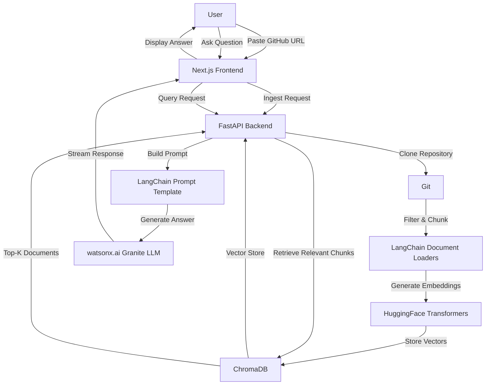

# RepoLens 🔍

**Chat with your codebase using AI-powered natural language understanding**

[](https://www.python.org/downloads/)
[](https://nextjs.org/)
[](https://www.ibm.com/watsonx)
[](LICENSE)

<p align="center">
  
</p>

---

## Overview

RepoLens transforms how developers understand and navigate unfamiliar codebases. Instead of spending hours reading through files, documentation, and code comments, simply paste a GitHub repository URL and ask questions in natural language.

**The Problem:** Developers waste countless hours trying to understand new codebases—tracing function calls, understanding architecture decisions, and finding relevant code sections. Traditional code search tools require exact keyword matches and don't understand context or intent.

**The Solution:** RepoLens uses advanced AI to create a semantic understanding of your entire codebase. Ask questions like "How does authentication work?" or "What are the main API endpoints?" and get instant, accurate answers with source code references. It's like having an expert developer who has already read and understood every line of code.

**How It Works:** Paste any public GitHub repository URL, and RepoLens clones it, intelligently chunks the code, generates semantic embeddings using HuggingFace transformers, and stores them in a ChromaDB vector database. When you ask a question, it retrieves the most relevant code sections and uses IBM's Granite language models via watsonx.ai to generate detailed, contextual answers with source citations—all streamed to you in real-time.

---

## ✨ Key Features

- **🤖 Natural Language Chat** - Ask questions about any GitHub repository in plain English and get intelligent, context-aware answers
- **⚡ Real-Time Streaming** - Responses stream token-by-token using Server-Sent Events (SSE) for instant feedback
- **🗺️ Interactive Mind Map** - Visualize your entire repository structure with an interactive, zoomable mind map featuring pan, zoom, expand/collapse controls
- **📊 Code Health Dashboard** - Analyze your codebase with language breakdown charts, file statistics, and top directory insights
- **🌲 Smart File Tree** - Browse repository files with click-to-explain functionality—click any file to get an AI explanation of its purpose
- **💡 Suggested Questions** - Smart question chips help you get started with relevant queries about your codebase
- **📝 Auto-Summary on Ingestion** - Automatically generates a comprehensive repository overview after ingestion completes
- **🔍 RAG Pipeline** - Retrieval-Augmented Generation with ChromaDB vector store ensures accurate, source-backed answers
- **📚 Source Citations** - Every answer includes references to the specific files used, with relevance scoring
- **🎨 Material Design 3** - Beautiful, modern UI with 3D depth effects, smooth animations, and dark mode support
- **⚙️ Optimized Performance** - Query caching, vectorstore pooling, adaptive polling, and code splitting for blazing-fast responses

---

## 🛠️ Tech Stack

| Layer | Technologies |
|-------|-------------|
| **Backend** | Python 3.11+, FastAPI, LangChain, ChromaDB, ibm-watsonx-ai, HuggingFace Transformers |
| **Frontend** | Next.js 16, React 19, TypeScript, Framer Motion, Material UI, Tailwind CSS |
| **AI Engine** | IBM watsonx.ai (Granite 4 H Small), HuggingFace Embeddings (all-MiniLM-L6-v2) |
| **Vector Store** | ChromaDB with HNSW indexing for fast similarity search |
| **Package Management** | uv (Python), npm (Node.js) |

---

## 🏗️ Architecture



**Key Components:**
1. **Ingestion Pipeline** - Clones repositories, filters relevant files, chunks code, generates embeddings, and stores in ChromaDB
2. **Query Pipeline** - Retrieves relevant code chunks, builds structured prompts, generates answers with Granite LLM
3. **Streaming Interface** - Real-time token streaming via Server-Sent Events (SSE)
4. **Visualization Layer** - Interactive mind maps, file trees, and code health dashboards

---

## 🚀 Getting Started

### Prerequisites
- Python 3.11+
- Node.js 18+
- uv (Python package manager)
- Git

### Backend Setup
```bash
# Navigate to backend directory
cd repolens-backend

# Copy environment variables template
cp .env.example .env

# Edit .env with your watsonx.ai credentials
nano .env

# Install dependencies using uv
uv sync

# Start the FastAPI server
uv run uvicorn main:app --reload
```

### Frontend Setup
```bash
# Navigate to frontend directory
cd repolens-frontend

# Copy environment variables template
cp .env.example .env.local

# Install dependencies
npm install

# Start the Next.js development server
npm run dev
```

### Access the Application
Open [http://localhost:3000](http://localhost:3000) in your browser.

---

## 🔧 Environment Variables

### Backend (.env)
| Variable | Description | Required |
|-----------|-------------|----------|
| `WATSONX_API_KEY` | IBM watsonx.ai API key | ✅ |
| `WATSONX_PROJECT_ID` | watsonx.ai project ID | ✅ |
| `WATSONX_URL` | watsonx.ai service URL (default: `https://us-south.ml.cloud.ibm.com`) | ❌ |
| `ENVIRONMENT` | Application environment (default: `development`) | ❌ |
| `DEBUG` | Debug mode (default: `true`) | ❌ |
| `HOST` | Server host (default: `0.0.0.0`) | ❌ |
| `PORT` | Server port (default: `8000`) | ❌ |
| `DATA_DIR` | Data storage directory (default: `./data`) | ❌ |
| `HF_TOKEN` | HuggingFace token (optional) | ❌ |

### Frontend (.env.local)
| Variable | Description | Required |
|-----------|-------------|----------|
| `NEXT_PUBLIC_API_URL` | Backend API URL (default: `http://localhost:8000`) | ❌ |

---

## 📡 API Endpoints

| Endpoint | Method | Description | Response |
|----------|--------|-------------|----------|
| `/api/health` | GET | Health check | `HealthResponse` |
| `/api/ingest` | POST | Ingest a GitHub repository | `IngestResponse` |
| `/api/ingest/{repo_id}/status` | GET | Get ingestion status | `IngestionStatus` |
| `/api/ingest/{repo_id}/files` | GET | List all files in repository | `List[file_paths]` |
| `/api/ingest/{repo_id}/stats` | GET | Code health statistics | `RepoStats` |
| `/api/ingest/{repo_id}/structure` | GET | Repository structure for mind map | `RepoStructure` |
| `/api/query` | POST | Query repository (non-streaming) | `QueryResponse` |
| `/api/query/stream` | POST | Query repository (streaming SSE) | `Stream[token]` |

---

## 📁 Project Structure

```
repolens/
├── repolens-backend/          # FastAPI backend
│   ├── app/                   # Application code
│   │   ├── api/               # API routes
│   │   ├── services/          # Business logic
│   │   ├── config.py          # Configuration
│   │   ├── models.py          # Pydantic models
│   │   └── rag.py             # RAG pipeline
│   ├── main.py                # FastAPI entry point
│   └── pyproject.toml         # Python dependencies
│
└── repolens-frontend/         # Next.js frontend
    ├── app/                   # Next.js app router
    │   └── page.tsx           # Main page
    ├── components/            # React components
    │   ├── ChatInterface3D.tsx # 3D chat interface
    │   ├── FileTree.tsx        # Interactive file tree
    │   ├── MindMapVisualization.tsx # Mind map visualization
    │   └── CodeHealthDashboard.tsx # Code health stats
    ├── services/              # API service layer
    │   └── api.ts             # API client
    └── types/                  # TypeScript types
```

---

## 🤖 IBM watsonx.ai Integration

RepoLens leverages IBM's enterprise-grade watsonx.ai platform with these key features:

1. **Granite 4 H Small Model** - Uses the `ibm/granite-4-h-small` model, optimized for code understanding and detailed technical explanations
2. **IAM Token Management** - Automatically handles token refresh (tokens expire every 60 minutes) through the LangChain WatsonxLLM client
3. **Optimized Parameters** - Configured with:
   - `max_new_tokens=1500` for detailed answers
   - `temperature=0.2` for precise, factual responses
   - Custom stop sequences to prevent hallucinated follow-ups
4. **Structured Prompting** - Uses a carefully designed prompt template that instructs the model to:
   - Provide concise summaries first
   - Reference specific file paths and code patterns
   - Explain connections between different code sections
   - Avoid inventing non-existent code

The backend automatically refreshes IAM tokens as needed, ensuring uninterrupted service even during long sessions.

---

## 🛠️ Built with IBM Bob

RepoLens was developed with **IBM Bob** as an AI pair programmer throughout the entire lifecycle:

- **Architecture** — RAG pipeline design, ChromaDB schema, FastAPI project structure, streaming SSE system
- **Code Generation** — watsonx.ai IAM token refresh, SSE streaming endpoint, recursive tree builder, interactive SVG mind map
- **Debugging** — Diagnosed ingestion timeouts, duplicate node ID collisions, React key errors, model compatibility issues
- **UI/UX** — Material Design 3 component system, glassmorphism effects, animated 3D cards, dark mode
- **Documentation** — README, AGENTS.md, API docs, inline code comments

---

## 📄 License

This project is licensed under the **MIT License** — see the [LICENSE](LICENSE) file for details.

---

**Built with ❤️ using IBM watsonx.ai and IBM Bob**
